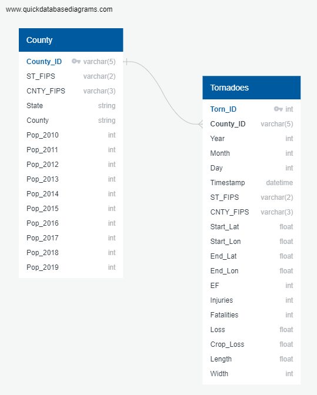

# Group 2 Final Project

<<<<<<< HEAD
Link to Google Slides
https://docs.google.com/presentation/d/1zSgH7H8bt0tgr5ZWaSebuRSi6RUVaBKLAAeG2BsMXpk/edit?usp=sharing


## Overview of Project
   - **Selected topic:**
       Tornadoes
   - **Reason why we selected our topic:**  
     - Tornados are fascinating and devasting at the same time. All members of our group are interested in this topic, especially given that we are currently experiencing spring severe weather season. 
     - Group members mostly reside in Tennesse, with one member currently living in the Midwest (who recently relocated from Memphis, TN).
     - As we began to research this topic, an **EF-3** tornado struck Andover, KS, the evening of April 29, 2022. Wind speeds reached at least 136 miles per hour with experts estimating damage to several hundred homes and businesses, including Andover's local YMCA, which sustained a direct hit. Despite the high level of destruction, only minor injuries were reported.      
     [https://weather.com/storms/severe/news/2022-04-29-tornado-andover-kansas-nebraska-oklahoma](https://weather.com/storms/severe/news/2022-04-29-tornado-andover-kansas-nebraska-oklahoma)
     [https://www.weather.gov/oun/efscale](https://www.weather.gov/oun/efscale)
     - We intend to further evaluate our data and see where it takes us.
     
   - **Description of the data sources:**   
     - Our group utilized the SPC National Severe Weather Database Browser to download severe weather data including tornadoes (since 1950), as well as hail and damaging winds data (since 1955). 
       - [https://www.spc.noaa.gov/climo/online/sp3/plot.php](https://www.spc.noaa.gov/climo/online/sp3/plot.php)
       - The data is derived from the National Weather Service's Storm Data publication, which is reviewed and processed by the National Climatic Data Center and the Storm Prediction Center
      
   - **Questions we hope to answer with the data:** 
   
     - Which tornado magnitude is the most common?

     - Which state has the most tornados?

     - In which month do the most tornados occur? 

     - Evaluation of tornado width versus tornado magnitude.

     - Can we predict the number of fatalaties resulting from a tornado if we know the magnitude (EF rating) and population of the county? 
     
     - Evaluation of how 'Tornado Alley' may be changing over time.


## Machine Learning Model

**General ML Info:**
  - The selected ML model will take in data in from the provisional database (additional details below). 
  - The ML model outputs label(s) for the input data.
  - - The selected ML model will take in data in from the provisional database (additional details below). 
  - The ML model outputs label(s) for the input data.
  - **Our group's selected Machine Learning models:** 
    - **Logistic Regression**
    - **RandomForest**
      - To predict tornado magnitude (EF score)
      - To predict fatalaties
    - **Neural Network**
   - We intend to utilize our ML model(s) to accomplish the following: 
     - Find relationships between tornado EF scale ranking to number of injuries, fatalities, loss metrics
     - Determine if the model can predict the tornado's EF score based on these metrics? or vice versa?
     - Focus on metrics such as tornado location, width & length to predict loss
     - Utilize loss (financial) & crop loss to predict EF rating 

**TBD**
   - We intend to TBD ML model to accomplish the following: 
     - Find relationships between tornado EF scale ranking to number of injuries, fatalities, loss metrics
     - Determine if the model can predict the tornado's EF score based on these metrics? or vice versa?
     - Focus on metrics such as tornado location, width & length to predict loss
     - Utilize loss (financial) & crop loss to predict EF rating
   - Once we become more familiar with the data, we may determine that more sophisticated ML algorithms are needed to strengthen our understanding of the data and/or improve our results. 

## Database:
  - Our SQL database is being remote hosted on **Amazon's AWS Relational Database Service (RDS)** free tier. 
  - Our local PostgreSQL/pgAdmin database is connected to our Amazon RDS instance. 
  - Our database include two tables: County & Tornadoes (see ERD)
  - **Entity Relationship Diagram:**
    - ERD created with **QuickDBD Web App**: [https://www.quickdatabasediagrams.com/](https://www.quickdatabasediagrams.com/)
    - 
  - **Amazon RDS Database Link:** 
    - [tornado-db.cwzrmrb6gdt4.us-east-1.rds.amazonaws.com](tornado-db.cwzrmrb6gdt4.us-east-1.rds.amazonaws.com)
  - **Amazon S3 Data Set Links:** 
    - [https://group-2-project-tornadoes.s3.amazonaws.com/2008-2020_tornadoes_EF_cleaned_db.csv](https://group-2-project-tornadoes.s3.amazonaws.com/2008-2020_tornadoes_EF_cleaned_db.csv)
    - [https://group-2-project-tornadoes.s3.amazonaws.com/Population_cleaned_db.csv](https://group-2-project-tornadoes.s3.amazonaws.com/Population_cleaned_db.csv)
    - [https://group-2-project-tornadoes.s3.amazonaws.com/joined_torn_pop_data_2010-2019_db.csv](https://group-2-project-tornadoes.s3.amazonaws.com/joined_torn_pop_data_2010-2019_db.csv)
  - Via postgreSQL, we completed a left join of population data into our tornadoes data set. 
    - We encountered a challenge with the join because the tornado population data included a year column, whereas the County (Population) data didn't include a year column but a "Pop" column (integer data for population) with the year concatenated into the column name.
    - To account for this, I created a new table within postgreSQL by duplicating the original tornado table and adding a cnty_pop (county population) column to house the joined tornado & population data.
    - The join statement utilized was not a traditional join statement, but an implied join statement using PostgreSQL's UPDATE join syntax to update the values in the new table's cnty_pop column with data from the County table. 
    - [https://www.postgresqltutorial.com/postgresql-tutorial/postgresql-update-join/#:~:text=To%20join%20to%20another%20table,every%20row%20of%20table%20t2%20.](https://www.postgresqltutorial.com/postgresql-tutorial/postgresql-update-join/#:~:text=To%20join%20to%20another%20table,every%20row%20of%20table%20t2%20.)
    - The information was joined one year at a time into the new table to ensure that the appropriate columns were being updated. 
    - UPDATE join code example: 
```
--Join pop data into torn_pop 2010
UPDATE torn_pop
SET cnty_pop = county.pop_2010
FROM county
WHERE county.county_id = torn_pop.county_id
AND torn_pop.year = 2010;
```
  - At least one of our machine learning models will be connected to our Amazon RDS database via **Google Colaboratory**.

### Dashboard

  - Google Slides Storyboard (In Progress) 
    - Link: [https://docs.google.com/presentation/d/1zSgH7H8bt0tgr5ZWaSebuRSi6RUVaBKLAAeG2BsMXpk/edit?usp=sharing](https://docs.google.com/presentation/d/1zSgH7H8bt0tgr5ZWaSebuRSi6RUVaBKLAAeG2BsMXpk/edit?usp=sharing)
  - Selected Dashboard Tool: Tableau
  - Description of interactive element(s): TBD
